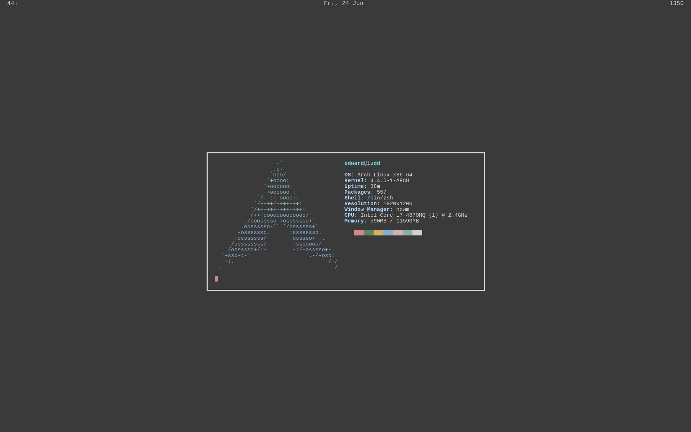

## Dotfiles

This is (among other things) my attempt at synchronizing my dotfiles across
several machines. If you happen to like or have questions about anything you
see here feel free to [hit me up](mailto:ehernandez@email.wm.edu).

### Structure

This repository is now set up for use with [GNU Stow](). It assumes that it is
a direct subdirectory of `$HOME` and that `$XDG_CONFIG_HOME` is `.config`.

### Programs

- **Operating system**: [Arch Linux](http://archlinux.org)
- **Interactive shell**: [zsh](www.zsh.org)
- **Scripting shell**: [dash](https://wiki.archlinux.org/index.php/Dash)
- **Text editor**: [neovim](http://neovim.io)
- **Email client**: [mutt]()
- **Terminal emulator**: [st](http://st.suckless.org)
	- also [urxvt]()
- **Colorscheme**: [Base16]() Oceans
- **Browser**: [firefox]() with [vimperator]()

#### Current setup:

